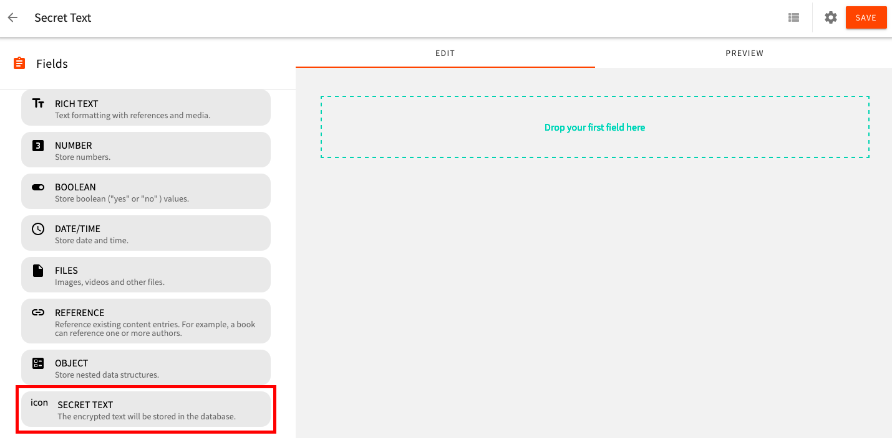

## Introduction
Example Headless CMS plugin to demonstrate the community plugin contribution process.

This plugin is created by following the [community plugin contribution guide](#) and [headless CMS custom field tutorial](https://www.webiny.com/docs/tutorials/headless-cms/create-a-webiny-headless-cms-custom-field-plugin).




This custom field plugin will store encrypted data into the database, and decrypt it after retrieving it from the database, more details can be found in [this tutorial](https://www.webiny.com/docs/tutorials/headless-cms/create-a-webiny-headless-cms-custom-field-plugin).

## Maintainers
<table>
    <tr>
        <td align="center">
            <a href="https://github.com/Pavel910">
                
                <br />
                <sub><b>Pavel Denisjuk</b></sub>
            </a>
            <br />
        </td>
        <td align="center">
            <a href="https://github.com/swapnilmmane">
                
                <br />
                <sub><b>Swapnil M Mane</b></sub>
            </a>
            <br />
        </td>
    </tr>
</table>

## How to contribute to this plugin?
To set up the plugin with your Webiny project, please execute the following steps:

### 1. Clone plugins repository to the project root

`git clone https://github.com/webiny-contrib/plugins`

### 2. Add secretText plugin to the workspaces
Open the `package.json` present at project root and add `plugins/headlessCMS/secretText` line  under `workspaces`

### 3. Install dependencies and link the secretText workspace
Run `yarn && yarn link-workspaces` from the project root.

### 4. Watch the `secretText` package
Run `yarn webiny watch  -p @webiny-contrib/secret-text` from the project root.
This command will build the `secretText` package and watch for the further code changes.
More details on `watch` command can be found [here](https://www.webiny.com/docs/how-to-guides/use-watch-command).

### 5. Import Field Type Plugin

Import the `secretTextFieldPlugin` in `apps/admin/code/src/plugins/headlessCms.ts`.

```
import secretTextFieldPlugin from "@webiny-contrib/secret-text/ui/secretTextFieldPlugin";

(...)

secretTextFieldPlugin
```

### 6. Import Field Renderer Plugin

Import the `secretTextFieldRendererPlugin` plugin in `apps/admin/code/src/plugins/headlessCms.ts`


```
import secretTextFieldRendererPlugin from "@webiny-contrib/secret-text/ui/secretTextFieldRendererPlugin"

(...)

secretTextFieldRendererPlugin()
```

### 7. Import Field To GraphQL Plugin

Import `secretTextFieldPlugin` API plugin in `api/code/headlessCMS/src/index.ts`.

```
import secretTextFieldPlugin from "@webiny-contrib/secret-text/api/secretTextFieldPlugin"

(...)

secretTextFieldPlugin
```

### 8. Import Storage Transformations Plugin

Import this `secretTextFieldStoragePlugin` plugin in `api/code/headlessCMS/src/index.ts`

```
import secretTextFieldStoragePlugin from "@webiny-contrib/secret-text/api/secretTextFieldStoragePlugin"

(...)

secretTextFieldStoragePlugin()
```

### 9. Watch the admin and API application
To watch admin and API application, run the following command in the terminal.

`yarn webiny watch apps/admin --env dev`  

`yarn webiny watch api/code/headlessCMS --env dev`

More details on `watch` command can be found [here](https://www.webiny.com/docs/how-to-guides/use-watch-command).

### 10. Make the updates and raise the pull request
You can make the respective code changes to `plugins/headlessCMS/secretText` directory.
Once the changes are ready, please create a pull request to https://github.com/webiny-contrib/plugins repository.


