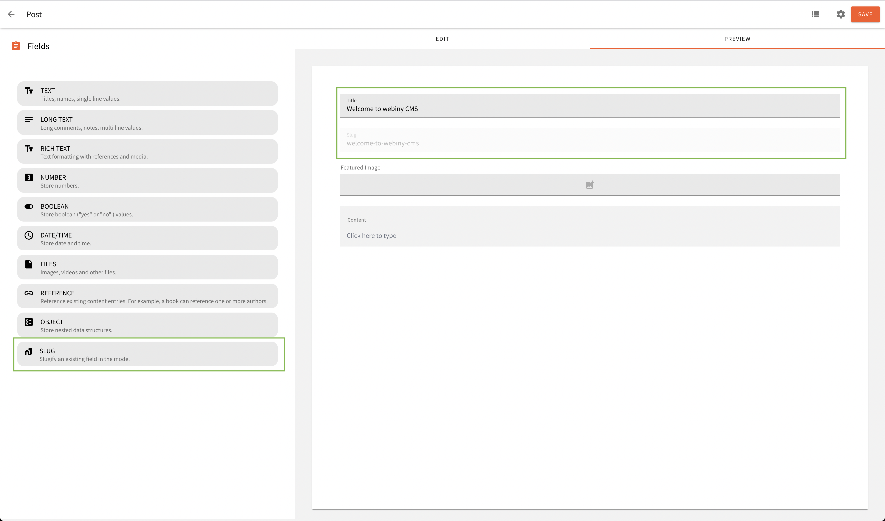
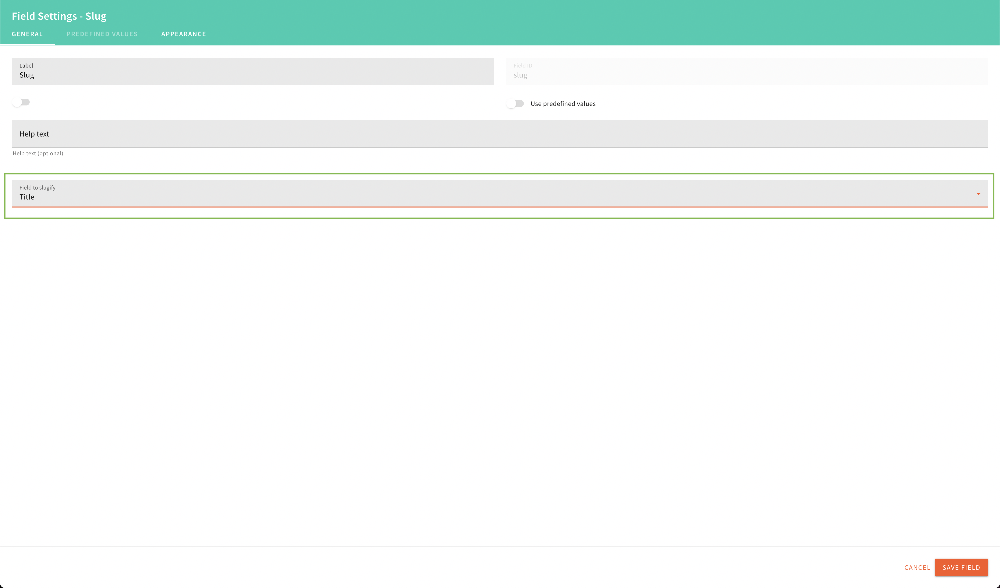

## Introduction

This custom field plugin will slugify the value of an existing textf field in the content model.




## Maintainers
<table>
    <tr>
        <td align="center">
            <a href="https://github.com/woodybriggs">
                
                <br />
                <sub><b>Woody Briggs</b></sub>
            </a>
            <br />
        </td>
    </tr>
</table>

## How to Contribute to Slug Field Plugin?
To set up the plugin with your Webiny project, please execute the following steps:

### 1. Clone `plugins` Repository to the Project Root

`git clone https://github.com/webiny-contrib/plugins`

### 2. Add slugField Plugin to the Workspaces
Open the `package.json` present at project root and add `plugins/headlessCMS/slugField` line  under `workspaces`

### 3. Install Dependencies and Link the Workspace
Run `yarn && yarn link-workspaces` from the project root.

### 4. Watch the `slugField` Package
Run `yarn webiny watch  -p @webiny-contrib/slug-field` from the project root.
This command will build the `slugField` package and watch for the further code changes.
More details on `watch` command can be found [here](https://www.webiny.com/docs/how-to-guides/use-watch-command).

### 5. Import Field Type Plugin

Import the `slugFieldPlugin` in `apps/admin/code/src/plugins/headlessCms.ts`.

```
import slugFieldPlugin from "@webiny-contrib/slug-field/ui/slugFieldPlugin";

(...)

slugFieldPlugin
```

### 6. Import Field Renderer Plugin

Import the `slugFieldRendererPlugin` plugin in `apps/admin/code/src/plugins/headlessCms.ts`


```
import slugFieldRendererPlugin from "@webiny-contrib/slug-field/ui/slugFieldRendererPlugin"

(...)

slugFieldRendererPlugin()
```

### 7. Import Field To GraphQL Plugin

Import `slugFieldPlugin` API plugin in `api/code/headlessCMS/src/index.ts`.

```
import sluFieldPlugin from "@webiny-contrib/slug-field/api/slugFieldPlugin"

(...)

slugFieldPlugin
```

### 9. Watch the admin and api application
To watch admin and api applications, run the following command from the project root.

`yarn webiny watch apps/admin --env dev`  

`yarn webiny watch api/code/headlessCMS --env dev`

More details on `watch` command can be found [here](https://www.webiny.com/docs/how-to-guides/use-watch-command).

### 10. Make the Updates and Raise the Pull Request
To improve the plugin, you can make the respective code changes to `plugins/headlessCMS/slugField` directory.
Once the changes are ready, please create a pull request to https://github.com/webiny-contrib/plugins repository.
